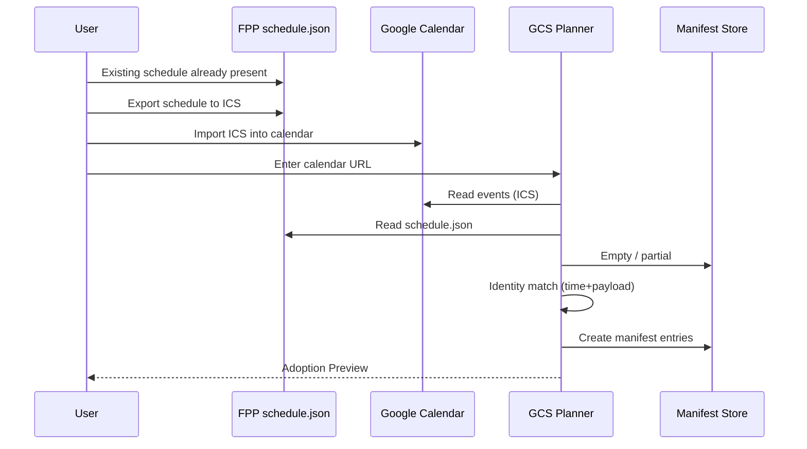
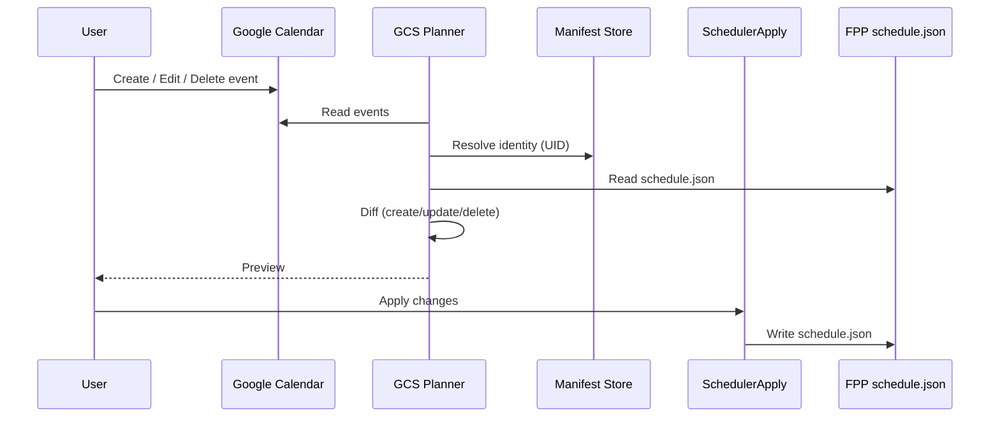
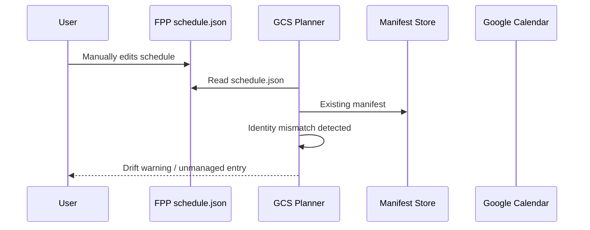

# Google Calendar Scheduler – Flows

## High-Level Lifecycle

```
FPP Schedule  →  Export ICS  →  Google Calendar
     ↑                               ↓
     └────────── Apply ◄── Planner ◄─┘
```

---

## Flow 1: Existing FPP Schedule → Adoption

1. User has existing FPP schedule
2. User exports ICS
3. User imports into Google Calendar
4. User provides Calendar URL to GCS
5. Planner builds desired intents
6. Diff matches by manifest (if present)
7. Apply attaches manifest + updates entries

UID may be NULL during steps 1–6.

---

## Flow 2: Google-first Changes

1. User edits Google Calendar
2. Planner detects semantic delta
3. Diff schedules UPDATE
4. Apply mutates FPP schedule.json

---

## Flow 3: FPP-side Changes (Out-of-Band)

1. User edits FPP directly
2. Entry has no manifest
3. Planner ignores or flags (policy-based)
4. No overwrite occurs

---

## Mixed-State Reality

At any moment:
- Some entries adopted
- Some exported but not adopted
- Some unmanaged
- Some conflicting

This is **expected**.





