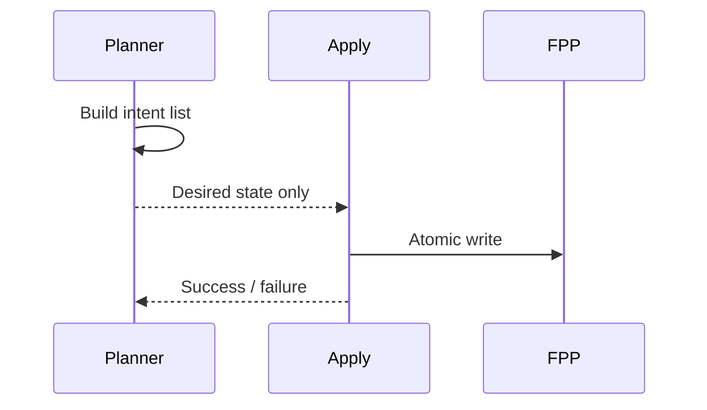

# Google Calendar Scheduler – Invariants

These rules MUST hold. Violations indicate bugs.

---

## Identity Invariants

- UID may be null
- Absence of UID ≠ error
- Manifest ID defines ownership
- Identity matching must complete before comparison

---

## Planner Invariants

- Planner never writes schedule.json
- Planner produces ScheduleIntent only
- Planner does not infer ownership

---

## Comparator Invariants

- Only canonical fields are compared
- No deep equality
- No normalization

---

## Apply Invariants

- Apply only mutates entries scheduled by Diff
- Apply never invents identity
- Apply preserves unmanaged entries

---

## Debugging Invariants

- Debug logs must not change behavior
- GCS_DEBUG must be optional
- Logging failure must not break flow

---

## Forbidden Behaviors

- Hardcoding command flags
- Silent adoption
- Writing Google Calendar
- Requiring UID for operation

sequenceDiagram
    participant Planner
    participant Manifest
    participant Comparator

    Planner->>Manifest: Resolve identity
    alt UID exists
        Manifest-->>Planner: UID
        Planner->>Comparator: Semantic compare
    else UID missing
        Manifest-->>Planner: null
        Planner->>Planner: Adoption candidate
    end

